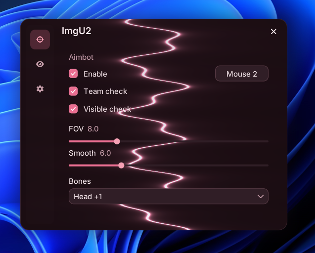

# custom-ui1

A glass overlay for Windows. Immediate-mode C++, Win32, Direct3D 11. Clicks on the panel stay with the menu. Clicks outside pass through to the desktop. Close with the X.

<p align="center">
  
</p>

<p align="center">
  
</p>

The drawing core, fonts, and input started from [ui-framework](https://github.com/ff0l1/ui-framework). The overlay window, glass styling, click-through, and the `imgui2` API are this repo.

```
overlay → Direct3D 11 → imgui2 → panel
```

## On the panel

One glass panel: rail, pages, short motion. Checks, keybinds, sliders, single-select and multi-select. Themes are Rose, Mocha, and Forest. Backgrounds are Lightning, Galaxy, and Plasma. DPI comes from the monitor, and there is a scale slider.

Include `imgui2/imgui2.hxx`. The namespace is `imgui2`.

## Build

Windows 10 SDK, MSVC, CMake 3.20, Ninja.

```
cmake --preset windows-release
cmake --build --preset windows-release
```

Or `tools\build-release.bat`. Run `build/windows-release/custom-ui-1.exe`. Keep `assets/` next to the executable.

## Hello

```cpp
#include "imgui2/imgui2.hxx"

int WINAPI WinMain( HINSTANCE, HINSTANCE, LPSTR, int ) {
    imgui2::app::Config Config;
    Config.title = "glass";
    return imgui2::app::run( Config, [ ] {
        if ( imgui2::ui::window Window( "glass" ); Window )
            imgui2::ui::label( "Drag the header to move." );
    } );
}
```

## Files

```
include/imgui2    public headers
src/overlay       layered Win32 window
src/ui            panel, rail, widgets
src/effects       backgrounds
src/engine        canvas, fonts, input, D3D11
demos/preview
docs/
```
