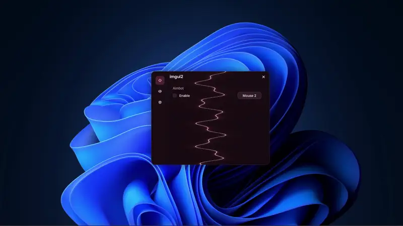

# custom-ui-1

A glass overlay UI for Windows. Immediate-mode C++, Win32, and Direct3D 11.

<p align="center">
  
</p>

custom-ui-1 is built on [custom-framework](https://github.com/ff0l/custom-framework) — the same drawing core, fonts, input, and Direct3D 11 host. Overlay chrome, glass styling, click-through, and the `imgui2` API are new.

```
Overlay → Direct3D 11 → imgui2 → UI
```

Clicks on the panel stay with the menu. Clicks outside pass through to the desktop. Close with the X.

## What you get

- Transparent layered overlay, topmost, no taskbar chrome
- One glass panel with a rail, pages, and short motion
- Checks, keybinds, sliders, single-select and multi-select dropdowns
- Rose, Mocha, and Forest themes
- Lightning, Galaxy, and Plasma backgrounds
- DPI from the monitor, plus a scale slider

The C++ namespace is `imgui2`. Include `imgui2/imgui2.hpp`.

## Build

Windows 10 SDK, MSVC, CMake 3.20, Ninja.

```
cmake --preset windows-release
cmake --build --preset windows-release
```

Or `tools\build-release.bat`. Run `build/windows-release/custom-ui-1.exe`. Keep `assets/` next to the executable.

## Hello

```cpp
#include "imgui2/imgui2.hpp"

int WINAPI WinMain( HINSTANCE, HINSTANCE, LPSTR, int ) {
    imgui2::app::Config Config;
    Config.title = "custom-ui-1";
    return imgui2::app::run( Config, [ ] {
        if ( imgui2::ui::window Window( "custom-ui-1" ); Window )
            imgui2::ui::label( "A quiet overlay. Close when you are done." );
    } );
}
```

Drag the header to move the panel.

## Tree

```
include/imgui2      public headers
src/app             run loop, scale, fps cap
src/overlay         layered Win32 window
src/ui              panel, rail, widgets
src/effects         reactive backgrounds
src/engine          canvas, fonts, input, D3D11
src/host            Eleven host
demos/preview       bundled menu
docs                preview on this page
```

The engine in `src/engine` started from [custom-framework](https://github.com/ff0l/custom-framework).
